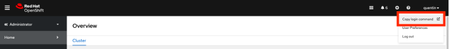

# Installation de MAS dans un environnement Airgap

Cette documentation a pour objectif de décrire comment installer MAS dans un cluster Openshift Airgap.

Elle a été testée dans les configurations suivantes :
- Openshift 4.16
- Maximo Application Suite v9.0.10
- IBM Maximo Operator Catalog v9-250306-amd64
- Podman v5.4.2
- MAS CLI v13.15.0

## Prérequis
- Un repository d'entreprise (Docker Registry, par exemple)
- Un cluster Openshift en v4.16
- Une station de travail ou Bastion équipé de [Docker](https://www.docker.com/products/docker-desktop/) ou [Podman](https://podman-desktop.io/) avec une connexion à internet et au repository d'entreprise
- Une [IBM Entitlement Key](https://myibm.ibm.com/products-services/containerlibrary)
- Un [RedHat Pull Secret](https://console.redhat.com/openshift/install/pull-secret)
- Un fichier de licences Maximo Application Suite

## Copie des opérateurs
1. Définir les variables d'environnement :
```bash
export IBM_ENTITLEMENT_KEY=<Votre Entitlement Key>
export LOCAL_DIR=<Votre dossier de travail local>
export REGISTRY_HOST=<Nom d hôte de votre repository d entreprise>
export REGISTRY_PORT=<Port de votre repository d entreprise>
export REGISTRY_USERNAME=<Nom d utilisateur de votre repository d entreprise>
export REGISTRY_PASSWORD=<Mot de passe de votre repository d entreprise>
export REGISTRY_CA=<Nom du fichier contenant le certificat de votre repository d entreprise>
export REDHAT_SECRET=/mnt/registry/pull-secret.txt
export OCP_VERSION=4.16
export CLI_VERSION=13.15.0
export CATALOG_VERSION=v9-250306-amd64
export MAS_CHANNEL=9.0.x
```
2. Copier l'image du CLI en local :
```bash
oc image mirror --dir $LOCAL_DIR/cli quay.io/ibmmas/cli:$CLI_VERSION file://ibmmas/cli:$CLI_VERSION
```
3. Télécharger l'image du CLI sur le repository d'entreprise :
```bash
podman login $REGISTRY_HOST:$REGISTRY_PORT -u $REGISTRY_USERNAME -p $REGISTRY_PASSWORD
oc image mirror --dir $LOCAL_DIR/cli file://ibmmas/cli:$CLI_VERSION $REGISTRY_HOST:$REGISTRY_PORT/ibmmas/cli:$CLI_VERSION
```
4. Déposer le pull secret de RedHat dans le dossier `$LOCAL_DIR`
5. Copier les images RedHat requises pour l'installation de MAS :
```bash
podman run -ti --rm --platform linux/amd64 -v $LOCAL_DIR:/mnt/registry quay.io/ibmmas/cli:$CLI_VERSION mas mirror-redhat-images --mode direct --dir /mnt/registry/redhat -H $REGISTRY_HOST -P $REGISTRY_PORT -u $REGISTRY_USERNAME -p $REGISTRY_PASSWORD --pullsecret $REDHAT_SECRET --mirror-operators --release $OCP_VERSION --no-confirm
```
6. Copier les images de MAS Core :
```bash
podman run -ti --rm --platform linux/amd64 -v $LOCAL_DIR:/mnt/registry quay.io/ibmmas/cli:$CLI_VERSION mas mirror-images -m direct -d /mnt/registry/core -H $REGISTRY_HOST -P $REGISTRY_PORT -u $REGISTRY_USERNAME -p $REGISTRY_PASSWORD -c $CATALOG_VERSION -C $MAS_CHANNEL --mirror-catalog --mirror-core --ibm-entitlement $IBM_ENTITLEMENT_KEY
```
7. Copier les images MAS Manage :
```bash
podman run -ti --rm --platform linux/amd64 -v $LOCAL_DIR:/mnt/registry quay.io/ibmmas/cli:$CLI_VERSION mas mirror-images -m direct -d /mnt/registry/apps -H $REGISTRY_HOST -P $REGISTRY_PORT -u $REGISTRY_USERNAME -p $REGISTRY_PASSWORD -c $CATALOG_VERSION -C $MAS_CHANNEL --mirror-manage --ibm-entitlement $IBM_ENTITLEMENT_KEY
```
8. Copier les images des dépendances :
```bash
podman run -ti --rm --platform linux/amd64 -v $LOCAL_DIR:/mnt/registry quay.io/ibmmas/cli:$CLI_VERSION mas mirror-images -m direct -d /mnt/registry/others -H $REGISTRY_HOST -P $REGISTRY_PORT -u $REGISTRY_USERNAME -p $REGISTRY_PASSWORD -c $CATALOG_VERSION -C $MAS_CHANNEL --mirror-mongo --mirror-tsm --mirror-sls --mirror-cfs --ibm-entitlement $IBM_ENTITLEMENT_KEY 
```
9. (Optionnel) Copier les images de DB2 :
```bash
podman run -ti --rm --platform linux/amd64 -v $LOCAL_DIR:/mnt/registry quay.io/ibmmas/cli:$CLI_VERSION mas mirror-images -m direct -d /mnt/registry/others -H $REGISTRY_HOST -P $REGISTRY_PORT -u $REGISTRY_USERNAME -p $REGISTRY_PASSWORD -c $CATALOG_VERSION -C $MAS_CHANNEL --mirror-db2 --ibm-entitlement $IBM_ENTITLEMENT_KEY
```
10. Déposer le fichier de licences dans le dossier `$LOCAL_DIR`
11. Lancer le CLI d'installation MAS :
```bash
podman run -ti --rm --platform linux/amd64 -v $LOCAL_DIR:/mnt/home cli:$CLI_VERSION
```
12.	Se connecter au cluster Openshift depuis le CLI en copiant la commande de connexion depuis la console :


13. Copier le certificat du repository d'entreprise dans le dossier `$LOCAL_DIR`
14. Configurer les catalogues sur Openshift :
```bash
mas configure-airgap --setup-redhat-catalogs -H $REGISTRY_HOST -P $REGISTRY_PORT -u $REGISTRY_USERNAME -p $REGISTRY_PASSWORD --ca-file /mnt/home/$REGISTRY_CA --no-confirm
```
15. Créer la ImageTagMirrorSet en cliquant sur le + en haut à droite de la console Openshift :
```yaml
apiVersion: config.openshift.io/v1
kind: ImageTagMirrorSet
metadata:
  name: image-policy-quay-tag
spec:
  imageTagMirrors:
    - mirrors:
        - '$REGISTRY_HOST: $REGISTRY_PORT/ibmmas'
      source: quay.io/ibmmas
```
16. Lancer l'installation de MAS :
```bash
mas install
```